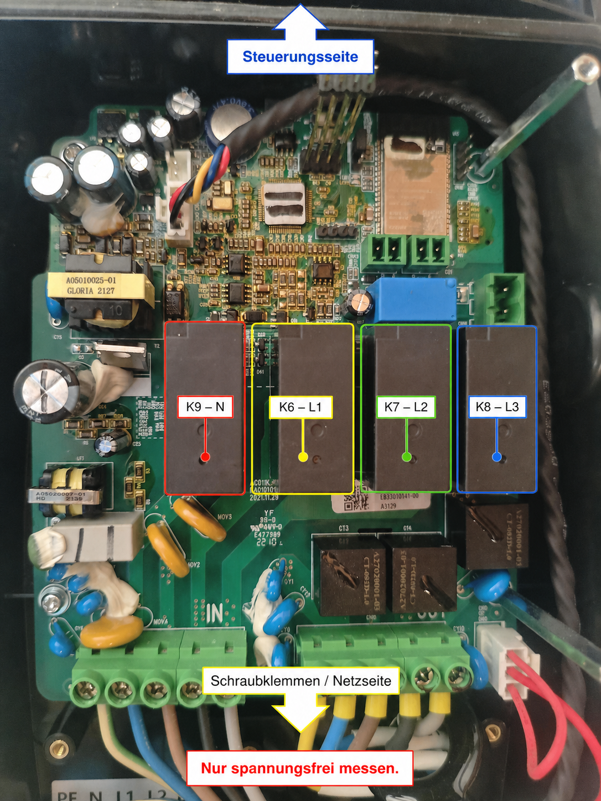

# AC011K WARP PhaseSwitch

We actually got it working: a WARP More-flashed AC011K-AE-25 can charge on
N+L1 only and dynamically switch between one and three phases. A requested
power in kW is converted to one of the physically representable combinations
of 1/3 phases and 6–16 A. The ESP32 performs the controlled stop, waits for a
fresh physical CP-B release from the EV, keeps an off delay, configures the
GD32, restarts charging and verifies the resulting phase currents.

This is not a claim that every AC011K or Sungrow AC011E is compatible. It is a
carefully documented, reproducible experiment that passed on one exact board.

## Compatibility: known, inferred and unknown

### Physically verified

| Item | Tested value |
|---|---|
| Product reported by GD | `AC011K-AE-25` |
| Main PCB | `AC011K-AE-25 V1` |
| PCB identifier | `EA01010188-00` |
| PCB date | `2021-11-29` |
| Power relays | four black relays, K9/K6/K7/K8 |
| Original GD firmware | `1.2.460` |
| Original GD binary SHA-256 | `181e1ba228848a778d9e5639b8732bf14659ef7e52577ce74fcecdd15fa72909` |
| Patched GD binary SHA-256 | `38a7c6364d7940d274ca2c8712cd38465f518fa4ebddb9575df75fd2b37f4f9b` |
| ESP source commit tested | `9f0e2ad` |
| Vehicle acceptance | MG4, 1p→3p and 3p→1p |

The test board and its relays:



### Strongly supported, but not universally proven

- The GD patch is intentionally restricted to the exact 1.2.460 base image.
- The same PCB identifier, relay layout and coil network are strong evidence
  for compatibility, but another production batch may still differ.
- Other IEC 61851 vehicles should release CP from C to B after the controlled
  stop, but only the MG4 has completed the full dynamic acceptance test so far.

### Unknown or unsupported

- AC011K-AE-25 V2 and other PCB revisions.
- AC011K-AE-35, AC011E-01 variants or visually similar Sungrow-branded boxes.
- Any GD image whose binary SHA-256 differs from the value above.
- Long-duration unattended operation and every possible vehicle/edge case.
- Manufacturer approval, certification or warranty status after modification.

The ESP checks the reported hardware and GD version before exposing the phase
path. The builder refuses an unknown base hash. Neither check can identify
every silent PCB production change, so compare the hardware before flashing.

## What was tested

The first acceptance rig used a passive CP A/B/C simulator, a 230 V indicator
on L1 and separate 60 W incandescent loads on L2 and L3. This made a phantom
voltage or a purely logical firmware status impossible to mistake for a closed
power path.


The final MG4 test measured:

- 1p/6 A: L1 5.9 A, L2/L3 0 A, about 1.39 kW;
- 1p→3p: L1/L2/L3 each 5.7 A, about 3.98 kW;
- 3p→1p: L1 5.9 A, L2/L3 0 A, about 1.39 kW;
- final stop: CP B, contactors open, 0 W, GD fault 0.

See [the complete acceptance log](ACCEPTANCE_TESTS.md) and
[the live relay experiment matrix](LIVE_TEST_RESULTS.de.md).

## Architecture

```text
Home Assistant / EMHASS
    requested power in watts
              │ MQTT/API
              ▼
ESP32 / WARP More
    choose 1/3 phases and 6–16 A
    stop → require fresh raw CP B → off delay
    set GD mode → verify readback → restart
    verify measured phase count
              │ private GD protocol
              ▼
GD32F103
    original CP, PWM, current and fault logic
    minimally patched relay closing sequence
              │
              ▼
K9=N, K6=L1, K7=L2, K8=L3
```

The high-level PV, battery and grid strategy remains in Home Assistant/EMHASS.
The ESP receives one power target and owns the complete physical transition.
The GD remains the normal low-level EVSE and safety controller.

## Installation overview

1. Start from a working WARP More installation and create the documented
   firmware backup first.
2. Verify the reported model and original GD version/hash.
3. Upload the release's ESP **app/OTA binary** through the WARP web updater.
4. Upload the release's patched GD **HEX file** through the WARP GD firmware
   updater. The GD bootloader region is unchanged.
5. After reboot, verify `supported`, GD fault 0 and open contactors before
   connecting a vehicle.
6. Start with the lowest useful power and supervise the first 1p/3p changes.

The release also contains a merged ESP image for serial recovery/full-flash
work. It is not the file to select in the normal web OTA updater.

Both the ESP application and the GD HEX were successfully uploaded through the
WARP web UI on the tested box. If the modified ESP application is unsuitable,
the normal WARP More application can be uploaded again. If the GD application
still responds to the WARP updater, stock 1.2.460 can likewise be restored.
This does not turn flashing into a zero-risk operation; an interrupted or
incompatible low-level update can still require physical recovery hardware.

## Power control and MQTT

This fork uses the existing WARP API-to-MQTT infrastructure; it does not add a
second MQTT client. With the normal `AC011K/<device-id>/` prefix:

```text
state:   evse/power_manager
command: evse/power_target_update
payload: {"power_w": 5000}
```

The ESP evaluates every combination of 1/3 phases and whole currents from 6 to
16 A. Depending on `rounding_mode`, it chooses the next higher, next lower or
nearest representable power. A new target arriving during a transition replaces
the older target; obsolete intermediate targets are not restarted.

See [Home Assistant and MQTT](HOME_ASSISTANT.md) for the current migration
state and the intentionally manual power slider.

## How the GD32 patch works

The GD image is raw ARM Thumb/Thumb-2 code for a Cortex-M3. Ghidra revealed a
relay state machine that calls the same GPIO helpers with four port/pin pairs:
PA8, PB3, PC6 and PB9. Those calls identified the candidates; they did not by
themselves prove which physical contact moved.

The physical mapping emerged from a sequence of deliberately small live
patches and independent L1/L2/L3 loads. Some early patches left one or more
phases on and correctly triggered the GD's stuck-output fault. The decisive
test suppressed every stock closing pulse except the PB3 differential path:
only L1 pulsed briefly. Holding that path until the untouched stock stop path
ran produced stable N+L1 charging and clean opening.

The final patch redirects nine existing four-byte Thumb call/return sites into
three short routines in a previously zero-filled flash area at `0x08037B00`.
Mode bit 0 selects stock three-phase behavior or the verified one-phase relay
sequence. Marker bits prove that the patched command handler and final physical
close hook were really executed. The vector table, GD bootloader and complete
stock stop/open path remain byte-identical.

Read [the full reverse-engineering report](REVERSE_ENGINEERING.md) for the
addresses, bytes, experiments, facts and remaining interpretations.

To reproduce the GD image from a legally obtained exact base image:

```bash
python3 -m venv .venv
.venv/bin/pip install -r extras/ac011k-phase-switch/tools/requirements.txt
.venv/bin/python extras/ac011k-phase-switch/tools/build_gd_selectable_1p_3p_1_2_460.py \
  AC011K-AE-25_V1.2.460.bin output
```

This procedure was rerun from the published tools before release. Its BIN and
HEX outputs were byte-identical to the files used in the live tests.

## Home Assistant status

MQTT Auto Discovery currently covers phase-switch state, active phases,
requested/effective power diagnostics, calculated current/phases and rounding.
The primary kW slider is still a manual MQTT `number` in `configuration.yaml`.
That was a conscious compatibility choice: the existing entity ID, dashboard
and automations were kept while the tested wallbox control path changed below
them. Completing this migration to a fully auto-discovered power number is on
the to-do list.

The motivation is ordinary PV surplus charging: a relatively small PV system
often has 1.4–3.5 kW available but cannot reach the roughly 4.1 kW minimum of
three-phase 6 A charging. Automatic one-phase operation makes that otherwise
stranded range useful.

## Credits

- **Jonas / Allcrafter1** supplied the hardware, opened and documented the
  board, traced and measured the relay coil network, built the wonderfully
  improvised CP/lamp test rig, performed every physical switching test and
  accepted the real-vehicle risk on his own hardware.
- **OpenAI Codex** performed the firmware/tooling analysis, wrote and iterated
  the GD binary patches, implemented the ESP state machine and MQTT/API layer,
  analyzed the logs and produced the documentation with Jonas.
- **WARP More contributors** created the open ESP32 firmware and GD web-update
  foundation that made this experiment practical and recoverable.

This was very much a human-in-the-loop reverse-engineering project: software
analysis proposed the next smallest experiment; the lamps, multimeter, relay
clicks and MG4 decided whether the theory survived reality.

## Next work

- finish Auto Discovery for the primary power slider;
- add clean generic Home Assistant and EMHASS examples;
- test target replacement and unplugging during a switch;
- test ESP/GD/power restart recovery and timeout paths;
- perform longer soak tests;
- collect photos, firmware hashes and results from other hardware revisions;
- only then propose a cleaned upstream integration.
